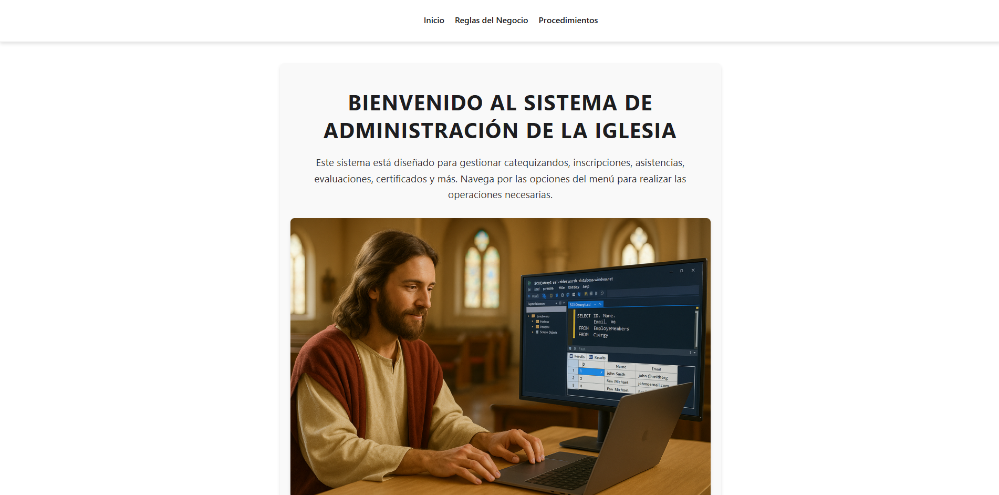

# Church Database Management System

Welcome to the **Church Database Management System**, a web application designed to help manage catechizing records for a church. This project combines a modern frontend built with React and a robust backend powered by Flask, with MongoDB as the NoSQL database for flexible document storage.

<p align="center">
  
</p>

---

## Features

- **User-Friendly Interface**: A clean and intuitive UI for managing catechizing records.
- **Dynamic Frontend**: Built with React for a responsive and interactive experience.
- **Powerful Backend**: Flask-based RESTful API for efficient data handling.
- **NoSQL Database Integration**: MongoDB for flexible document storage and complex data relationships.
- **Cross-Origin Support**: Enabled CORS for seamless communication between frontend and backend.
- **Document-Based Architecture**: Leverage MongoDB's document structure for nested data like sacraments and inscriptions.

---

## Technologies Used

### Frontend
- **React**: For building the user interface.
- **React Router**: For navigation between pages.
- **Axios**: For making HTTP requests to the backend.

### Backend
- **Flask**: For creating the RESTful API.
- **Flask-CORS**: For handling cross-origin requests.
- **PyMongo**: For connecting to the MongoDB database.
- **BSON**: For handling MongoDB ObjectIds and data types.

### Database
- **MongoDB**: NoSQL document database for storing catechizing records with flexible schema.

---

## Installation and Setup

### Backend (Flask)

1. Navigate to the `servidor` directory:
   ```bash
   cd servidor
   ```

2. Install the required dependencies:
   ```bash
   pip install flask flask-cors pymongo bson
   ```

3. Start the Flask server:
   ```bash
   python run.py
   ```

### Frontend (React)

1. Navigate to the `cliente` directory:
   ```bash
   cd cliente
   ```

2. Install the required dependencies:
   ```bash
   npm install
   ```

3. Start the React development server:
   ```bash
   npm start
   ```

---

## Project Structure

```
Church-DB-Management/
├── cliente/          # React frontend
│   ├── src/
│   │   ├── app/
│   │   │   ├── App.js
│   │   │   └── App.css
│   │   ├── Components/
│   │   │   └── NavBar/
│   │   │       ├── Navbar.jsx
│   │   │       └── Navbar.css
│   │   ├── Pages/
│   │   │   ├── Inicio.jsx
│   │   │   ├── ReglasNegocio.jsx
│   │   │   └── Crud/
│   │   │       ├── Crud.jsx
│   │   │       ├── Crud.css
│   │   │       └── CRUDS/
│   │   │           ├── CrudCatequizandos.jsx
│   │   │           ├── CrudParroquias.jsx
│   │   │           └── CrudCatequistas.jsx
│   │   ├── index.js
│   │   └── index.css
├── Servidor/         # Flask backend
│   ├── app/
│   │   ├── __init__.py
│   │   ├── db.py
│   │   ├── models/
│   │   │   ├── catequizando.py
│   │   │   ├── parroquia.py
│   │   │   └── catequista.py
│   │   └── routes/
│   │       ├── catequizando.py
│   │       ├── parroquia.py
│   │       └── catequista.py
│   ├── requirements.txt
│   └── run.py
├── DB CHURCH.sql     # Legacy SQL schema (for reference)
└── README.md         # Documentation
```

---

## How to Use

1. **Setup MongoDB**: Make sure you have MongoDB Atlas or local MongoDB instance running.
2. **Configure Database Connection**: Update the connection string in `Servidor/app/db.py`.
3. Start both the backend and frontend servers.
4. Open your browser and go to: [http://localhost:3000](http://localhost:3000)
5. Use the navigation bar to:
   - View the **Inicio** page with a welcome message.
   - Access the **Reglas del Negocio** page to understand the business rules.
   - Access the **CRUD** page to manage collections (Catequizandos, Parroquias, Catequistas).
6. Select a collection and perform CRUD operations. The data will be stored in MongoDB as flexible documents.

---

## MongoDB Collections

The system uses the following MongoDB collections with schema validation:

### 1. **catequizandos** Collection
- **nombres**: String (required)
- **apellidos**: String (required)
- **fecha_nacimiento**: Date (required)
- **contacto**: String (required)
- **fe_bautismo**: Boolean (required)
- **sacramentos**: Array of documents with:
  - tipo_sacramento: String
  - fecha: Date
  - lugar: String
- **inscripciones**: Array of documents with:
  - inscripcion_id: ObjectId
  - parroquia_id: ObjectId
  - nivel_id: ObjectId
  - fecha_inscripcion: Date
  - estado: String
  - certificado_emitido: Boolean
  - asistencias: Array of attendance records
  - evaluacion: Object with calificacion and observaciones

### 2. **parroquias** Collection
- **nombre**: String (required)
- **telefono**: String
- **direccion**: Object with calle and ciudad
- **niveles_catequesis**: Array of catechesis levels

### 3. **catequistas** Collection
- **nombres**: String (required)
- **apellidos**: String (required)
- **rol**: String (required)
- **contacto**: String (required)

---

## API Endpoints

### Catequizandos
- `GET /api/catequizando` - Get all catequizandos
- `GET /api/catequizando/<id>` - Get catequizando by ID
- `POST /api/catequizando` - Create new catequizando
- `PUT /api/catequizando/<id>` - Update catequizando
- `DELETE /api/catequizando/<id>` - Delete catequizando

### Parroquias
- `GET /api/parroquia` - Get all parroquias
- `GET /api/parroquia/<id>` - Get parroquia by ID
- `POST /api/parroquia` - Create new parroquia
- `PUT /api/parroquia/<id>` - Update parroquia
- `DELETE /api/parroquia/<id>` - Delete parroquia

### Catequistas
- `GET /api/catequista` - Get all catequistas
- `GET /api/catequista/<id>` - Get catequista by ID
- `POST /api/catequista` - Create new catequista
- `PUT /api/catequista/<id>` - Update catequista
- `DELETE /api/catequista/<id>` - Delete catequista

---

## Contributing

Contributions are welcome! If you'd like to contribute, feel free to fork this repository, make your changes, and submit a pull request.

---

## License

This project is licensed under the MIT License.

---

## Author

Developed with ❤️ by **byPronox**
